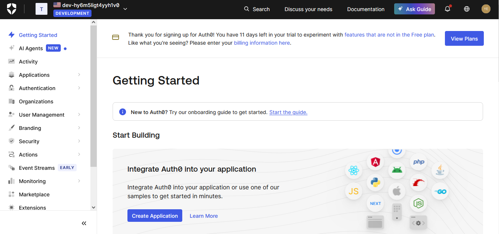
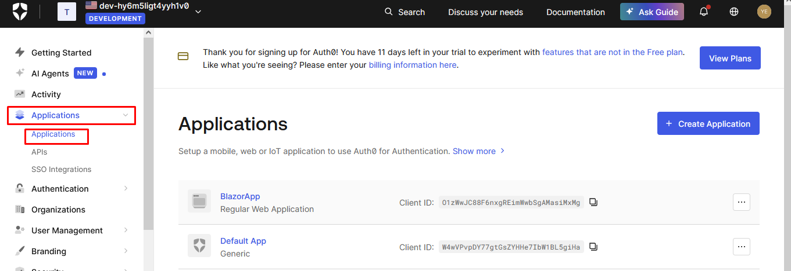
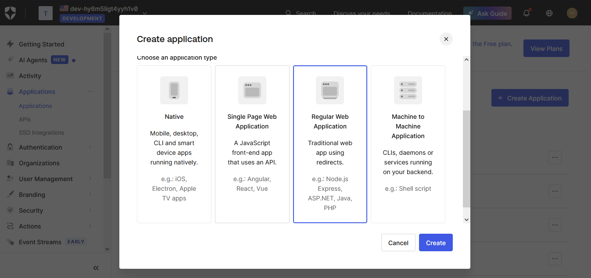
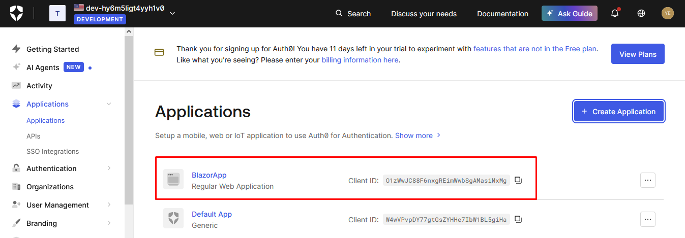
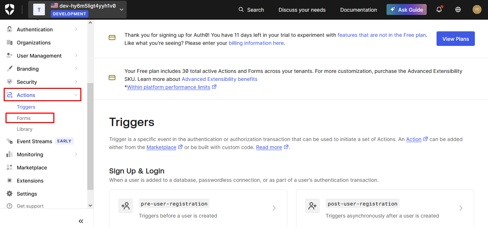
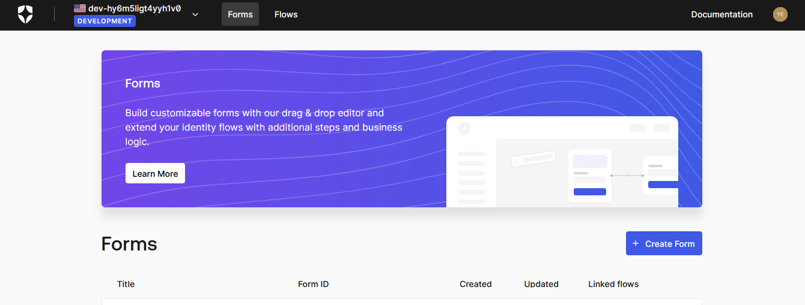
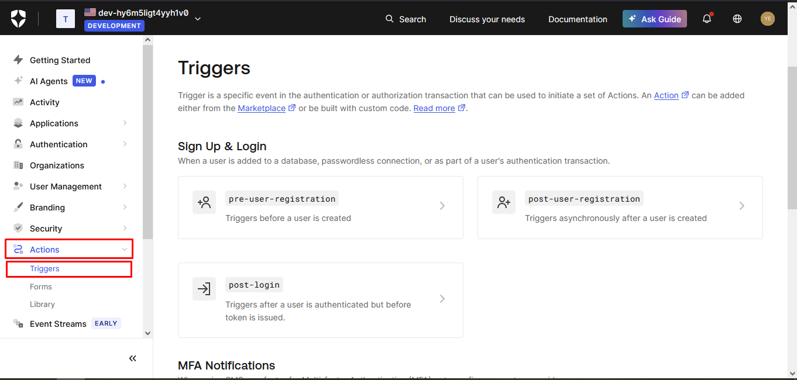
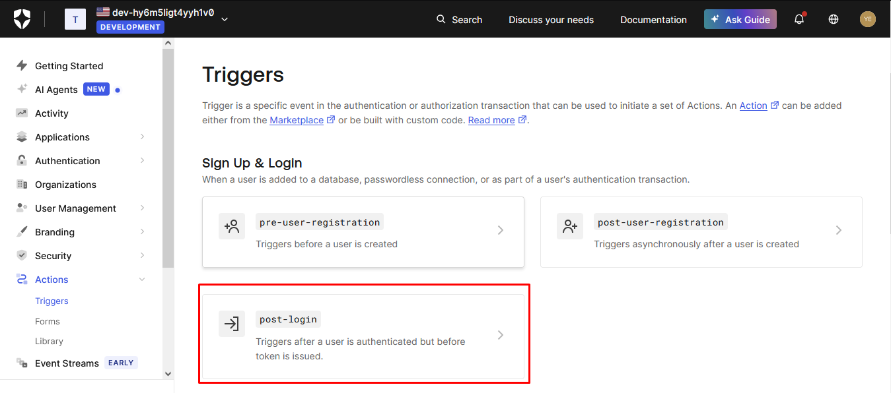
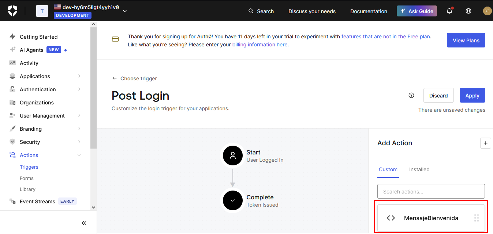
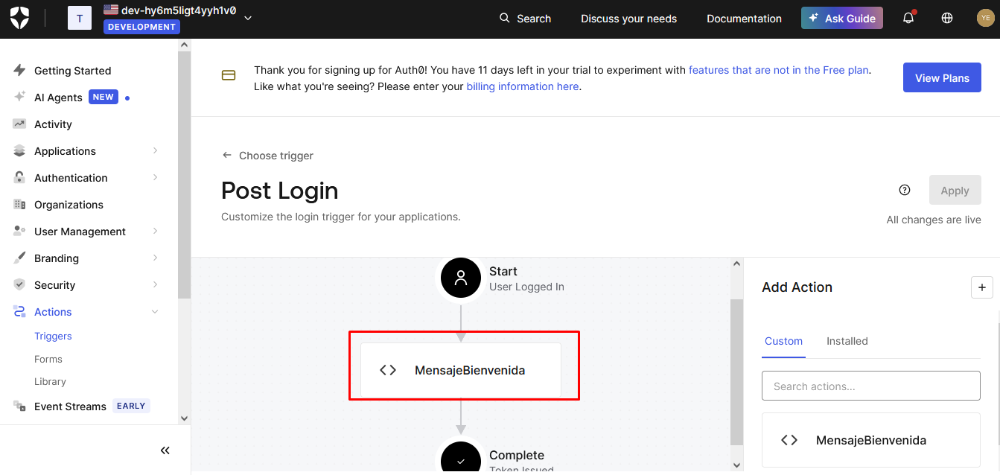

# Integracion Auth0 + Blazor App

Este documento sirve de guía básica para crear una integración funcional desde Auth0 con una aplicación Blazor App.

## Tabla de contenido

- [Prerequisitos](#prerequisitos)
- [Creación de aplicacion en Auth0](#creación-de-aplicacion-en-auth0)
- [Creación de formulario](#creación-de-formulario)
- [Creación de flujo post-login en Auth0](#creación-de-flujo-post-login-en-auth0)

## Prerequisitos

Para realizar esta practica es necesario tener instalado los siguientes componentes:

- [.Net SDK 10](https://dotnet.microsoft.com/en-us/download/dotnet/thank-you/sdk-10.0.103-windows-x64-installer)
- [Visual Studio Code](https://code.visualstudio.com/download)
- [Auth0 Account](https://auth0.com/es/signup?place=header&type=button&text=registrarse)

**NOTA:** La guía es paso a paso, esta permite configurar el ambiente sin un conocimiento previo en .NET.

## Creación de aplicacion en Auth0

Para este paso es necesario previamente estar registrado y tener la cuenta activa en [Auth0](https://auth0.com/).

Una vez registrado, estarás frente a una pantalla de bienvenida

En esta pantalla, lo primero que haremos es crear una aplicación nueva, para esto debemos dar click en la parte izquierda en *Applications* -> *Applications*.

Al momento de ingresar, aparecerá un botón en la parte superior derecha, que nos permitirá crear una nueva aplicación. Debemos dar click allí, se abrirá un modal para nombrar la nueva aplicación y luego seleccionar el tipo de aplicación que se desea crear. Para el ejemplo nuestro, utilizaremos la *Regular Web Application*. Una vez se halla dado un nombre y se seleccione el tipo de aplicación, se da click al botón crear.

Cuando se cree la aplicación, se podrá observar en la pantalla principal.

[volver al inicio](#tabla-de-contenido)

## Creación de formulario

Los formularios hacen parte de los pasos que hará el usuario en cualquiera de estos momentos *Pre-registro*, *Post-registro* o *Post-autenticación*.

Para crear formularios, debemos dar click en *Actions* -> *Forms*.

Esto abrirá una ventana nueva en el navegador como la que se muestra acontinuación

## Creación de flujo post-login en Auth0

Para crear acciones que se ejecutarán en el proceso de autenticación, se debe realizar click en *Actions* -> *Triggers* en la parte izquierda de la pantalla.

Allí encontrará tres tipos de acciones permitidas:

- **pre-user-registration**: Acciones que se ejecutan antes del registro de los usuarios.
- **post-user-registration**: Acciones que se ejecutan de forma asincrona después de la creacion del usuario.
- **post-login**: Acciones que se ejecutan después de autenticarse.

Para nuestro ejemplo, realizaremos la creación de una acción *post-login*.

En la parte inferior izquierda, aparecerá nuestro formularío disponible para arrastrar al flujo de los datos.

Arrastra el mensaje de bienvenida al flujo, ubicalo entre *Start* y *Complete* y guarda los cambios

