# Integracion Auth0 + Blazor App

Este documento sirve de guía básica para crear una integración funcional desde Auth0 con una aplicación Blazor App.

## Tabla de contenido

- [Prerequisitos](#prerequisitos)
- [Creación de aplicacion en Auth0](#creación-de-aplicacion-en-auth0)
- [Creación de formulario en Auth0](#creación-de-formulario)
- [Creación de acción en Auth0](#creación-de-acción)
- [Creación de flujo post-login en Auth0](#creación-de-flujo-post-login-en-auth0)
- [Creación proyecto Blazor](#creación-de-proyecto-blazor-app)

## Prerequisitos

Para realizar esta practica es necesario tener instalado los siguientes componentes:

- [.Net SDK 10](https://dotnet.microsoft.com/en-us/download/dotnet/thank-you/sdk-10.0.103-windows-x64-installer)
- [Visual Studio Code](https://code.visualstudio.com/download)
- [Auth0 Account](https://auth0.com/es/signup?place=header&type=button&text=registrarse)

**NOTA:** La guía es paso a paso, esta permite configurar el ambiente sin un conocimiento previo en .NET.

## Creación de aplicacion en Auth0

Para este paso es necesario previamente estar registrado y tener la cuenta activa en [Auth0](https://auth0.com/).

Una vez registrado, estarás frente a una pantalla de bienvenida


En esta pantalla, lo primero que haremos es crear una aplicación nueva, para esto debemos dar click en la parte izquierda en *Applications* -> *Applications*.


Al momento de ingresar, aparecerá un botón en la parte superior derecha, que nos permitirá crear una nueva aplicación. Debemos dar click allí, se abrirá un modal para nombrar la nueva aplicación y luego seleccionar el tipo de aplicación que se desea crear. Para el ejemplo nuestro, utilizaremos la *Regular Web Application*. Una vez se halla dado un nombre y se seleccione el tipo de aplicación, se da click al botón crear.


Cuando se cree la aplicación, se podrá observar en la pantalla principal.


[volver al inicio](#tabla-de-contenido)

## Creación de formulario

Los formularios hacen parte de los pasos que hará el usuario en cualquiera de estos momentos *Pre-registro*, *Post-registro* o *Post-autenticación*.

Para crear formularios, debemos dar click en *Actions* -> *Forms*.


Esto abrirá una ventana nueva en el navegador como la que se muestra acontinuación


Allí en la parte superior derecha encontraras un botón para crear un nuevo formulario, debes dar click.

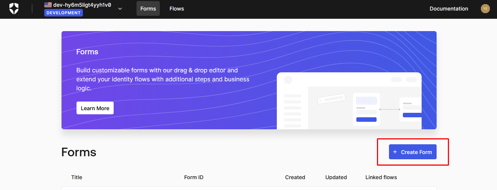

Selecciona la opción *Start from scratch*

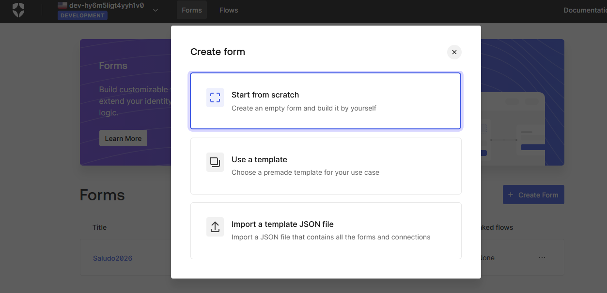

Se abre una pantalla donde encontraras en la parte izquierda todos los elementos que puedes usar arrastrando hacía los nodos de la parte derecha. Para poder construir el flujo del formulario existen 3 tipos de nodos usables:

- **Step**: Es el nodo más simple, permite definir un paso dentro del flujo.
- **Router**: Este nodo es de validación, permite escribir condiciones y a partir de estas condiciones diparar un paso adicional.
- **Flow**: Este nodo permite definir un flujo adicional de ejecución.

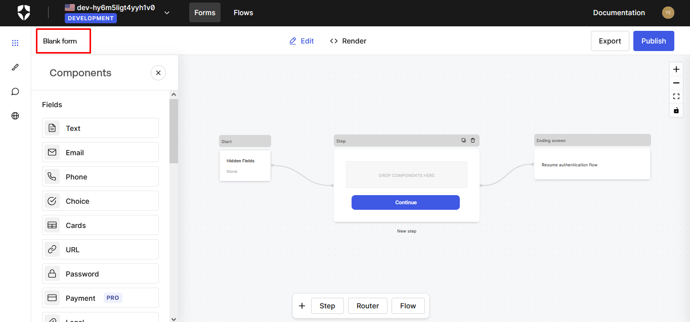

Para llevar a cabo nuestra práctica, vamos a crear los siguientes pasos:

- **Step - Bienvenida**: En este primer paso del flujo, agregaremos un *Rich Text* con el mensaje "Bienvenidos a nuestro aplicativo de prueba".

  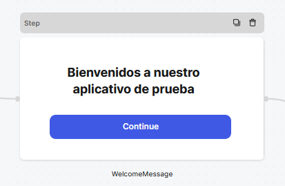

- **Step - Seleccionar opción**: Para construir este paso, deberá usar los siguientes elementos...

  - *Rich Text*: Este elemento se agrega en la parte superior del step con el mensaje "Seleccione ¿qué desea hacer hoy?"
  - *Divider*: Este elemento proporciona una división entre el titulo y los demás elementos.
  - *Dropdown*: Dentro de este elemento se configuran las diferentes opciones disponibles, en nuestro ejemplo: *Agregar hobbies*, *Mostrar frase del día*, *Salir*

  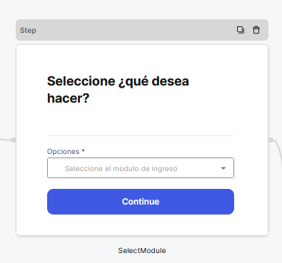

- **Router - Elegir una opción**: En este paso se deben crear las reglas de validacion para cada opción del dropdown

  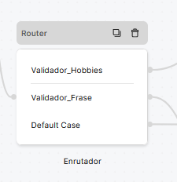

- **Step - Seleccion de hobbies**: Aquí debes crear el formulario usando...
  
  - *Rich Text*: Este elemento se agrega en la parte superior con el texto: "¿Qué te apasiona?"
  - *Delimiter*: Divide el titulo de las opciones permitidas.
  - *Choice*: Este elemento permite agregar check list para seleccionar los diferentes hobbies.

  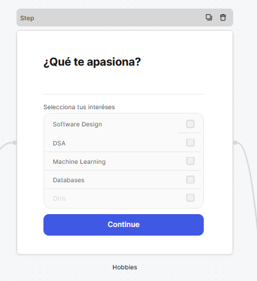

- **Step - Frase del día**: Para este caso, se agrega un solo *Rich Text* con la frase que se desee mostrar.

  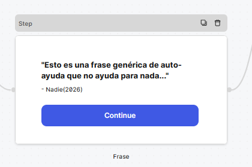

- **Step - Finalizar**: Redirigir la opción por defecto del enrutador para salir del flujo del formulario.

  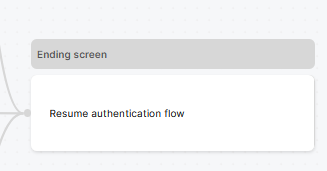

Al final tendras un flujo completo como el siguiente

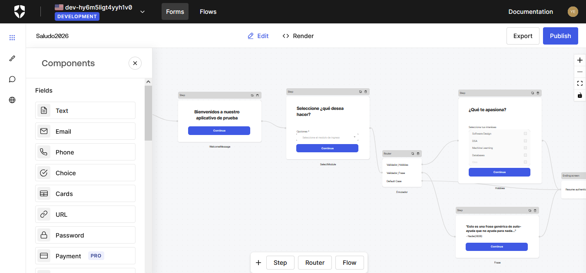

Finalmente se debe nombrar el flujo y posteriormente dar click en la parte superior derecha en el botón *Publish* para guardar el flujo personalizado.

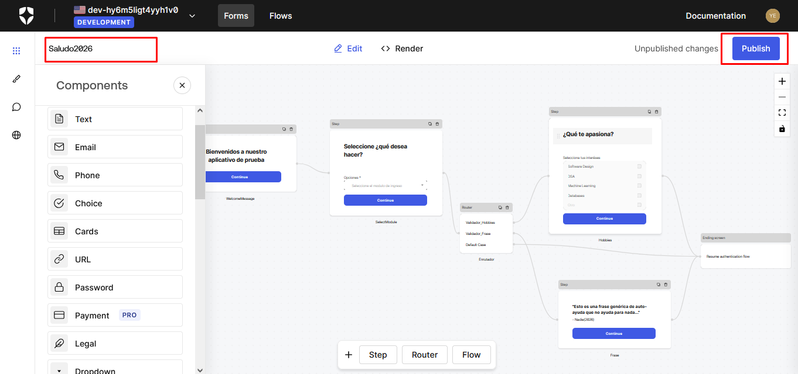

Para usar este formulario dentro de los flujos de Auth0, debes dar click en *Render* y copiar todo el codigo javascript.

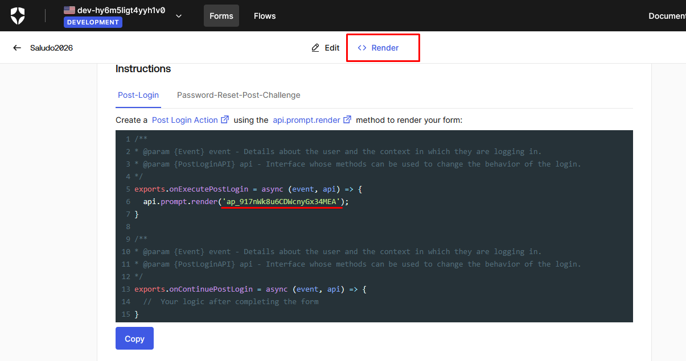

Es importante que copies el código que aparece en la pantalla ya que este hace referencia al formulario que acabas de crear.

```javascript
/**
* @param {Event} event - Details about the user and the context in which they are logging in.
* @param {PostLoginAPI} api - Interface whose methods can be used to change the behavior of the login.
*/
exports.onExecutePostLogin = async (event, api) => {
  api.prompt.render('HERE_IS_THE_FLOW_UUID');
}

/**
* @param {Event} event - Details about the user and the context in which they are logging in.
* @param {PostLoginAPI} api - Interface whose methods can be used to change the behavior of the login.
*/
exports.onContinuePostLogin = async (event, api) => {
  //  Your logic after completing the form
}
```

[Volver al inicio](#tabla-de-contenido)

## Creación de acción

Para crear una acción debemos dar click en *Actions* -> *Library* y luego dar click en *Create Action*

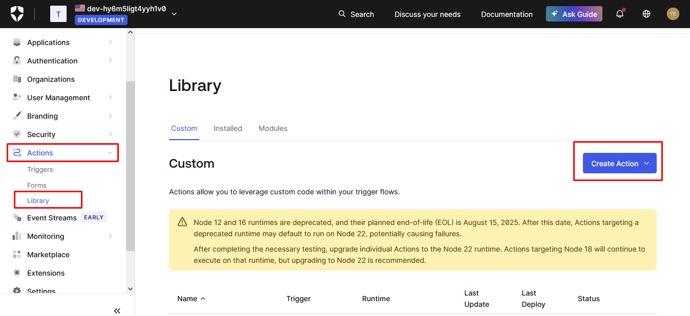

Una vez allí seleccione *Create Custom Action* y se abrira un formulario

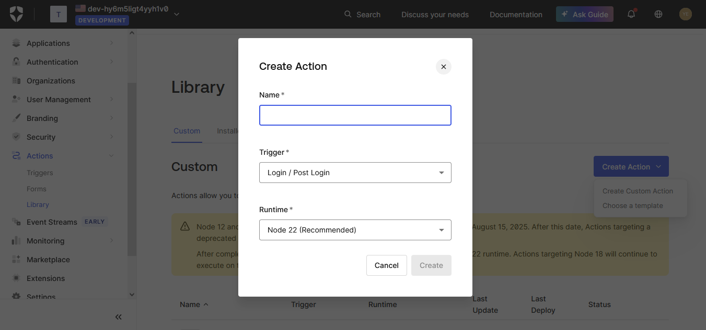

Asigne el nombre *MensajeBienvenida* a la acción y de crear. Allí deberá escribir el código que copió al momento de crear el formulario.

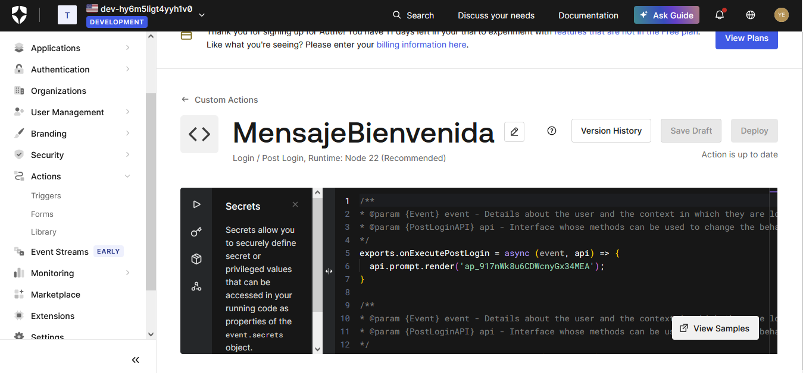

[Volver al inicio](#tabla-de-contenido)

## Creación de flujo post-login en Auth0

Para crear disparadores de acciones que se ejecutarán en el proceso de autenticación, se debe realizar click en *Actions* -> *Triggers* en la parte izquierda de la pantalla.


Allí encontrará tres tipos de acciones permitidas:

- **pre-user-registration**: Acciones que se ejecutan antes del registro de los usuarios.
- **post-user-registration**: Acciones que se ejecutan de forma asincrona después de la creacion del usuario.
- **post-login**: Acciones que se ejecutan después de autenticarse.

Para nuestro ejemplo, realizaremos la creación de una acción *post-login*.


En la parte inferior izquierda, aparecerá nuestro formularío disponible para arrastrar al flujo de los datos.


Arrastra el mensaje de bienvenida al flujo, ubicalo entre *Start* y *Complete* y guarda los cambios


Al finalizar este paso, ya nuestro flujo esta listo para ejecutar el formulario creado.

[Volver al inicio](#tabla-de-contenido)

## Creación de proyecto Blazor App

Para crear nuestro proyecto ejecutable en **.NET Blazor** debemos seguir la guía paso a paso presentada por **Auth0**. Para esto se debe dar click en *Applications* -> *Applications* allí elija la aplicación que creó al principio [ver mas...](#creación-de-aplicacion-en-auth0)

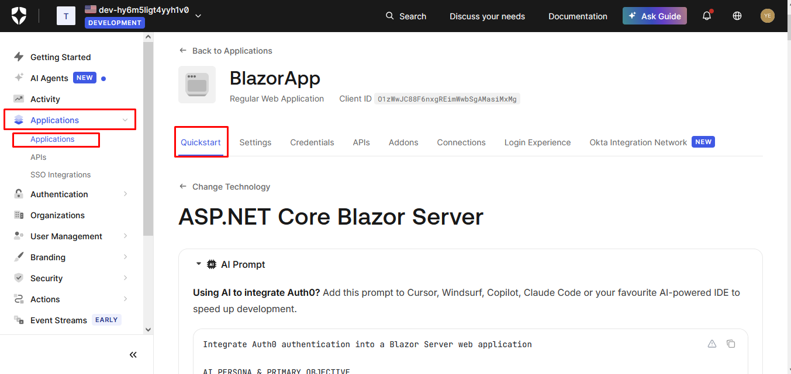

Al seguir esta guía paso a paso podrá ejecutar al final una aplición blazor como la que se muestra a continuación

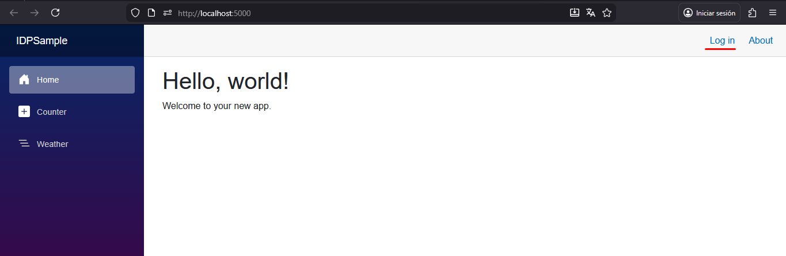

Al dar click en el link de login encontrará que se dispara el flujo de Auth0

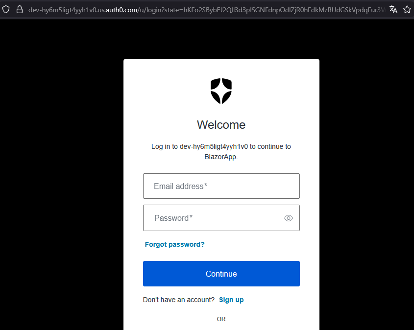

Una vez se halla registrado, podrá ingresar y aparecerá el mensaje de bienvenida

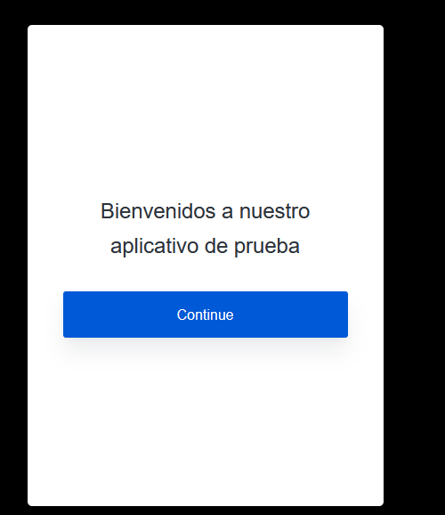

Luego de dar click en *Continue*, aparece el segundo paso y es la selección de ¿Qué desea hacer?

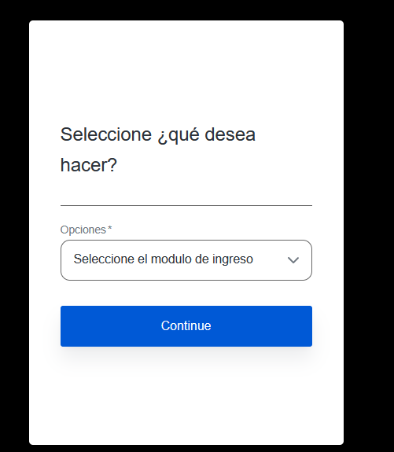

Una vez seleccione la opción, hay dos posibles caminos:

- *Agregar hobbies*: Se despliega el siguiente formulario

  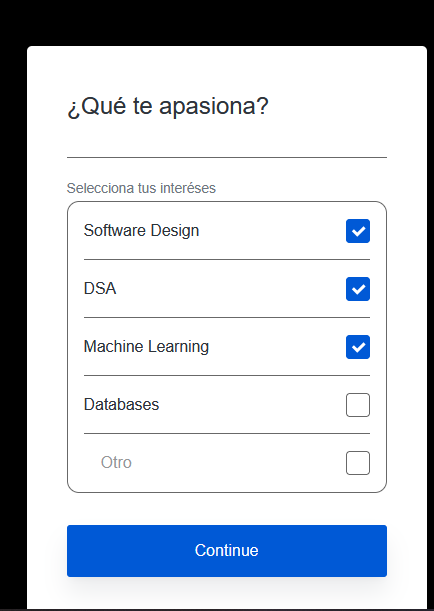

- *Mostrar frase del día*: Se muestra en pantalla la frase
  
  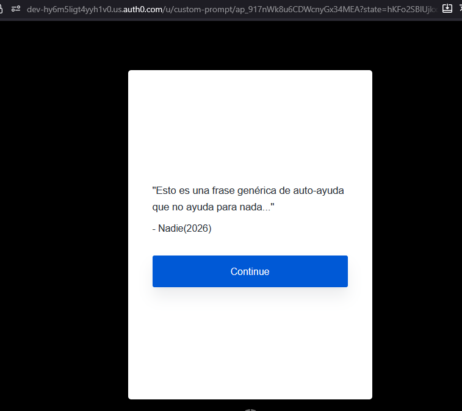

Ambas opciones al finalizar llevan a la siguiente pantalla donde se ve los datos de inicio de sesión

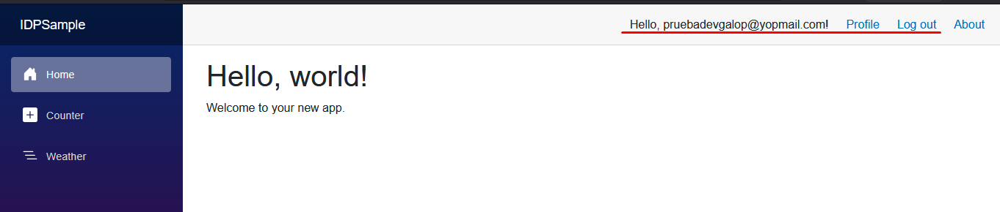

Al dar click en profile, se abre una pantalla con toda la información del usuario logueado

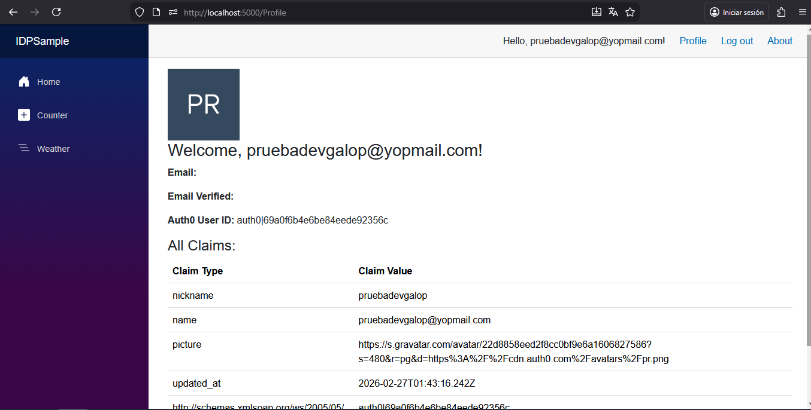

[Volver al inicio](#tabla-de-contenido)